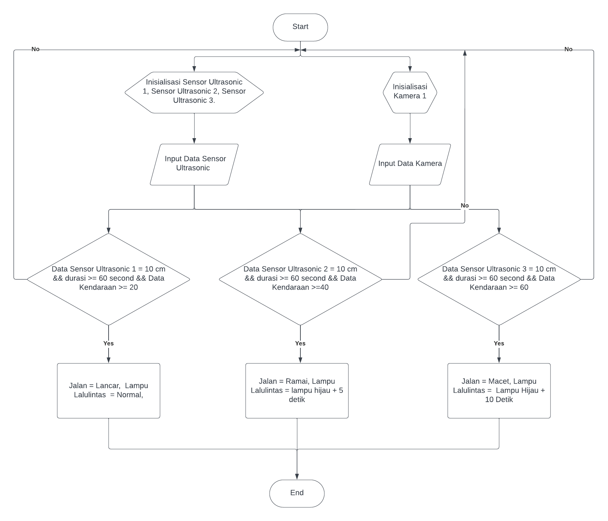
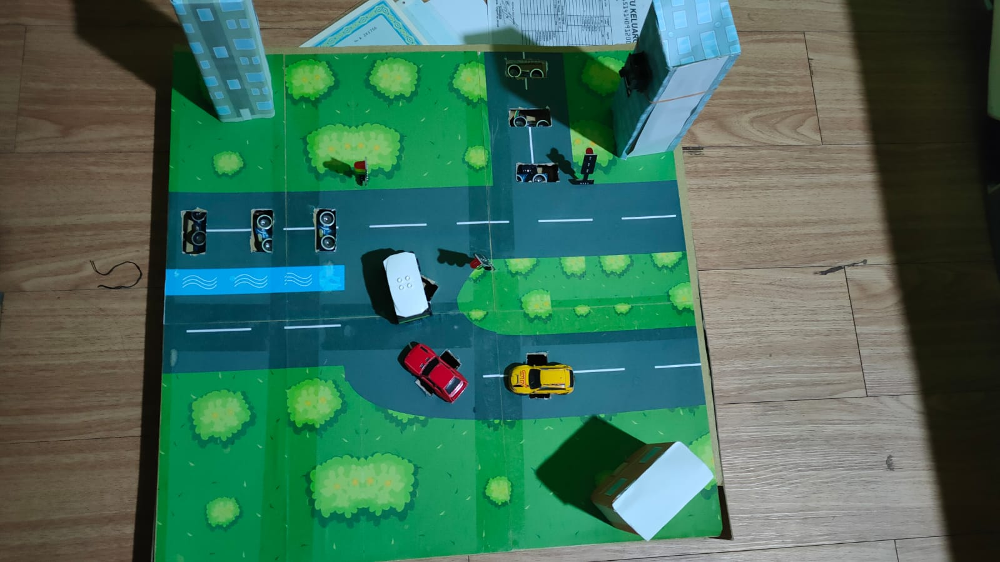

# 🚦 Sistem Smart Traffic
## Deteksi Kemacetan Berbasis Computer Vision, Sensor Ultrasonic, dan Terintegrasi Cloud

---

## 📌 Deskripsi Project

Smart Traffic adalah sistem lampu lalu lintas cerdas yang mampu mendeteksi tingkat kemacetan secara **real-time** menggunakan kombinasi:

- 📷 Computer Vision (YOLOv8)
- 📡 Sensor Ultrasonic
- 🔌 ESP32 & ESP32-CAM
- 🌐 Cloud Realtime Database (Firebase)

Sistem ini secara otomatis menyesuaikan durasi lampu hijau berdasarkan tingkat kepadatan kendaraan untuk mengurangi kemacetan di persimpangan jalan.

---

## 🏗 Arsitektur Sistem

Sistem terdiri dari beberapa komponen utama:

- **ESP32_A** → Membaca sensor ultrasonic dan mengirim data ke database
- **ESP32_B** → Mengontrol modul traffic light berdasarkan data dari database
- **ESP32-CAM** → Mengambil gambar/video kendaraan
- **Computer (Python + YOLOv8)** → Melakukan deteksi & perhitungan jumlah kendaraan
- **Cloud Database (Firebase)** → Penyimpanan & sinkronisasi data secara real-time

---

## 🔄 Alur Sistem

### 1️⃣ Inisialisasi
- Sensor Ultrasonic (u1, u2, u3) aktif
- ESP32 dan ESP32-CAM terkoneksi ke WiFi
- Kamera siap menangkap video
- Sistem terhubung ke database cloud

---

### 2️⃣ Deteksi Kendaraan (Computer Vision)

- Kamera menangkap frame video
- Model YOLOv8 mendeteksi kendaraan
- Sistem menghitung jumlah kendaraan
- Data jumlah kendaraan dikirim ke database

---

### 3️⃣ Deteksi Kepadatan (Ultrasonic)

Sensor ultrasonic mendeteksi:
- Jarak kendaraan
- Durasi kendaraan berhenti (≥ 60 detik)

Jika kendaraan berhenti terlalu lama → indikasi kemacetan

---

### 4️⃣ Klasifikasi Tingkat Kemacetan

| Status | Keterangan        | Durasi Lampu Hijau |
|--------|------------------|--------------------|
| 3      | Lancar           | 10 Detik           |
| 2      | Macet            | 15 Detik           |
| 1      | Sangat Macet     | 20 Detik           |

Penentuan status berdasarkan:
- Kombinasi data ultrasonic
- Jumlah kendaraan dari YOLO

---

### 5️⃣ Pengaturan Lampu Lalu Lintas

ESP32_B:
- Mengambil data status dari database
- Mengatur durasi lampu hijau secara adaptif
- Menyesuaikan waktu berdasarkan tingkat kemacetan

---

## 🧠 Teknologi yang Digunakan

- Python
- YOLOv8
- OpenCV
- ESP32
- ESP32-CAM
- Sensor Ultrasonic
- Firebase Realtime Database

---

## Dokumentasi

